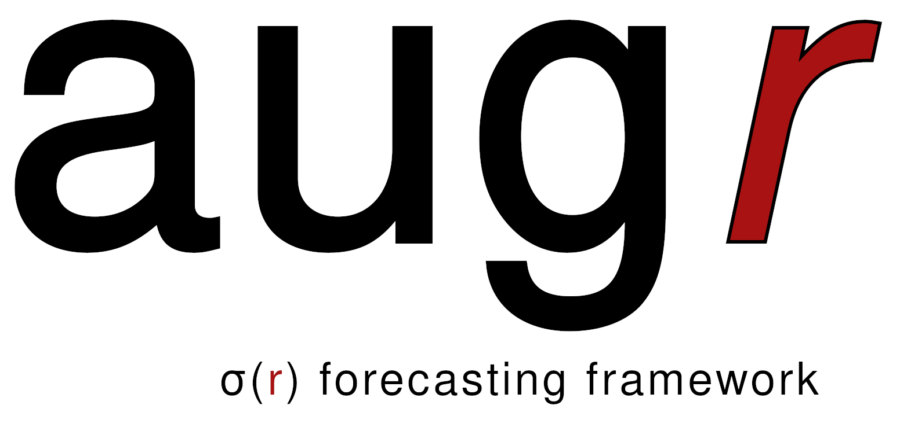

# augr



Fisher-matrix forecasting for CMB B-mode polarization experiments, targeting the tensor-to-scalar ratio *r*.

Built for the JPL CMB Probe 2026 study to explore how instrument design choices affect sensitivity to primordial gravitational waves in the presence of realistic Galactic foregrounds.

## What it does

Given an instrument specification (frequency bands, detector counts, noise levels, beam sizes, integration time), `augr` computes the marginalized Fisher constraint on *r* after accounting for:

- **Foreground contamination** from polarized dust and synchrotron, modeled as either a simple Gaussian (BK15-style, 9 parameters) or a moment expansion (17 parameters) that captures SED spatial variation and frequency decorrelation
- **Gravitational lensing** B-modes (parameterized by A_lens)
- **Priors** on foreground spectral indices from Planck/WMAP
- **Bandpower covariance** via the Knox formula across all frequency cross-spectra

The telescope design module derives detector counts and photon-noise-limited NETs from physical specifications (aperture, f-number, focal plane size, feedhorn packing), enabling systematic optimization of band layout and focal plane area allocation.

## Quick start

An "`augr`" `conda` environment is included with the needed dependencies.

```bash
make install   # create conda env + pip install -e .
make test      # run 169 tests
```

```python
from augr.telescope import probe_design, to_instrument
from augr.fisher import FisherForecast
from augr.foregrounds import MomentExpansionModel
from augr.signal import SignalModel
from augr.spectra import CMBSpectra
from augr.config import FIDUCIAL_MOMENT, DEFAULT_PRIORS_MOMENT, DEFAULT_FIXED_MOMENT

# Build instrument from mission+physical telescope specs
inst = to_instrument(probe_design())

# Set up the signal model
signal = SignalModel(
    inst,
    MomentExpansionModel(),
    CMBSpectra(),
    ell_min=2, ell_max=1000, delta_ell=30,
)

# Run the Fisher forecast
fiducial = {**FIDUCIAL_MOMENT, "A_lens": 0.27}  # 73% delensing
ff = FisherForecast(
    signal, inst, fiducial,
    priors=DEFAULT_PRIORS_MOMENT,
    fixed_params=DEFAULT_FIXED_MOMENT,
)
print(f"sigma(r) = {ff.sigma('r'):.2e}")
```

## Package structure

```
augr/
  config.py        Fiducial parameters, priors, and instrument presets
                   (simple_probe, pico_like, litebird_like, so_like, cmbs4_like)
  instrument.py    Channel, Instrument, ScalarEfficiency dataclasses;
                   noise power spectrum N_ell from NET, beam, and 1/f
  telescope.py     Physical telescope model: derives beams, detector counts,
                   and photon-noise NETs from aperture, focal plane, and
                   feedhorn geometry; supports dichroic pixel groups
  foregrounds.py   GaussianForegroundModel (9 params, BK15-style) and
                   MomentExpansionModel (17 params, Chluba+ 2017)
  spectra.py       CMB BB power spectra from CAMB templates (tensor + lensing)
  signal.py        SignalModel: assembles the binned cross-frequency data
                   vector and computes the Jacobian via jax.jacfwd
  covariance.py    Bandpower covariance matrix (Knox formula)
  fisher.py        Fisher information matrix, marginalized and conditional
                   constraints; Cholesky solver with eigendecomposition fallback
  units.py         Physical constants, RJ/CMB unit conversions, dust and
                   synchrotron SEDs and their log-derivatives

scripts/
  explore_designs.py   Band optimization: density scan, frequency range scan,
                       area allocation, experiment comparison (parallelized)
  validate_pico.py     Validation against PICO published sigma(r) targets
  plot_figure5.py      Reproduction of BICEP/Keck Figure 5 time evolution

tests/              169 tests covering all modules
data/               CAMB template spectra (tensor r=1, lensing)
plots/              Output from explore_designs.py
```

## Design principles

- **JAX throughout** for exact autodiff (Jacobians via `jax.jacfwd`) and JIT compilation.
- **Physics-based noise** from first principles (photon NEP, optical loading, feedhorn packing). Adding a mode to rescale from achieved performance is a potential future item.
- **Extensible foreground models** via a structural `Protocol` type. Any class with `parameter_names` and `cl_bb(nu_i, nu_j, ells, params)` works.
- **Frozen dataclasses** for all specifications (immutable, hashable, safe to pass across threads -- see example in `scripts/explore_designs.py`).
- **Realistic telescope and survey efficiency factors**: detector yield, survey efficiency, data loss, and more. For the telescope module, floor-based pixel counting, packing efficiency, and optical efficiency. Defaults are conservative, but optimistic "idealized" presets are available for comparison.

## Telescope design module

The `telescope.py` module derives a complete `Instrument` from physical specifications:

| Input | Default (probe) | Default (flagship) |
|---|---|---|
| Aperture | 1.5 m | 3.0 m |
| Focal ratio | f/2 | f/2 |
| Focal plane diameter | 0.4 m | 0.6 m |
| Telescope temperature | 4 K | 4 K |
| Optical efficiency | 0.35 | 0.35 |
| Pixel pitch | 2 F lambda (feedhorn) | 2 F lambda (feedhorn) |
| Packing efficiency | 80% | 80% |

"Idealized" variants (`probe_idealized`, `flagship_idealized`) use PICO-like assumptions (f/1.42, eta=0.50, 95% observing efficiency) for direct comparison, while retaining the feedhorn pixel pitch.

## Foreground models

**Gaussian (BK15-style):** Dust modified blackbody + synchrotron power law, with amplitudes, spectral indices, ell-dependence slopes, dust-sync correlation, and dust frequency decorrelation. 9 free parameters.

**Moment expansion (Chluba+ 2017):** Extends the Gaussian model with second-order terms capturing spatial variation of spectral parameters (variance of beta_d, T_d, beta_s, c_s, and their cross-moments). 17 free parameters. Reduces exactly to the Gaussian model when all moment amplitudes are zero.

## References

- Buza 2019, PhD thesis (Harvard) -- Fisher formalism, BICEP/Keck forecasting
- BICEP2/Keck 2018 (arXiv:1810.05216) -- BK15 foreground model and parameters
- Chluba et al. 2017 (arXiv:1701.00274) -- Moment expansion for foreground complexity
- Hanany et al. 2019 (arXiv:1902.10541) -- PICO probe study report
- Puglisi et al. 2025 (arXiv:2502.20452) -- PanEx PySM3 foreground models
- Bianchini et al. 2025 (ApJ 993:105) -- CMB-S4 foreground pipeline comparison
