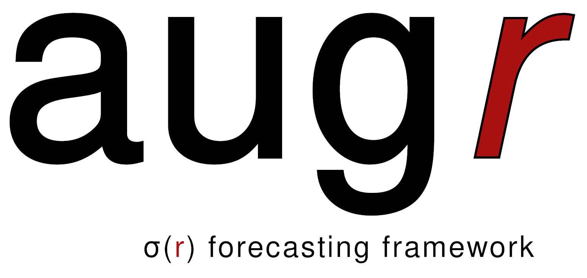

# augr



Fisher-matrix forecasting for CMB B-mode polarization experiments, targeting the tensor-to-scalar ratio *r*.

`augr` translates physical instrument specifications (aperture, focal plane geometry, detector counts, NETs, beams) into a marginalized Fisher constraint on *r*, accounting for Galactic foregrounds, gravitational lensing, and frequency-by-frequency cross-spectrum information. The full pipeline is JAX-differentiable end-to-end, so instrument design parameters can be optimized via `jax.grad`.

## What it does

Given an instrument specification (frequency bands, detector counts, noise levels, beam sizes, integration time), `augr` computes the marginalized Fisher constraint on *r* after accounting for:

- **Foreground contamination** from polarized dust and synchrotron, modeled as either a simple Gaussian (BK15-style, 9 parameters) or a moment expansion (17 parameters) that captures SED spatial variation and frequency decorrelation. A no-op model is also provided for forecasts on maps that have already been component-separated by an external pipeline.
- **Gravitational lensing** B-modes, either parameterized by A_lens or self-consistently delensed via iterative quadratic-estimator lensing reconstruction (flat-sky or full-sky Wigner 3j) — differentiable end-to-end, so σ(r) can credit the design-dependent delensing an instrument achieves
- **Priors** on foreground spectral indices from Planck/WMAP
- **Bandpower covariance** via the Knox formula across all frequency cross-spectra
- **Multi-patch likelihoods** with shared spectral indices and per-patch amplitudes, for sky regions of differing foreground complexity

The telescope design module derives detector counts and photon-noise-limited NETs from physical specifications (aperture, f-number, focal plane size, feedhorn packing), enabling systematic optimization of band layout and focal plane area allocation.

## Quick start

The project uses [pixi](https://pixi.sh/) to manage a reproducible
conda + pypi environment pinned via `pixi.lock`:

```bash
pixi install         # solve + install the locked environment
pixi run test        # run the fast pytest subset
pixi run test-all    # full suite (includes opt-in slow tests)
pixi run validate-pico   # PICO sigma(r) cross-check
pixi run nb          # launch jupyter lab on notebooks/
```

For a guided tour of the API, see [`notebooks/quickstart.ipynb`](notebooks/quickstart.ipynb).

```python
from augr.telescope import probe_design, to_instrument
from augr.fisher import FisherForecast
from augr.foregrounds import MomentExpansionModel
from augr.signal import SignalModel
from augr.spectra import CMBSpectra
from augr.config import FIDUCIAL_MOMENT, DEFAULT_PRIORS_MOMENT, DEFAULT_FIXED_MOMENT

# Build instrument from physical telescope specs
inst = to_instrument(probe_design())

# Set up the signal model
signal = SignalModel(
    inst,
    MomentExpansionModel(),
    CMBSpectra(),
    ell_min=2, ell_max=1000, delta_ell=30,
)

# Run the Fisher forecast -- two options for lensing:

# Option 1: fixed A_lens (fast, approximate)
fiducial = {**FIDUCIAL_MOMENT, "A_lens": 0.27}  # 73% delensing
ff = FisherForecast(
    signal, inst, fiducial,
    priors=DEFAULT_PRIORS_MOMENT,
    fixed_params=DEFAULT_FIXED_MOMENT,
)
print(f"sigma(r) = {ff.sigma('r'):.2e}")

# Option 2: self-consistent delensing (full-sky QE reconstruction)
from augr.delensing import load_lensing_spectra, iterate_delensing
from augr.instrument import combined_noise_nl
spec = load_lensing_spectra()
nl_bb = combined_noise_nl(inst, spec.ells, "BB")
result = iterate_delensing(spec, combined_noise_nl(inst, spec.ells, "TT"),
                           nl_bb, nl_bb, fullsky=True, n_iter=5)
signal_d = SignalModel(inst, MomentExpansionModel(), CMBSpectra(),
                       delensed_bb=result.cl_bb_res, delensed_bb_ells=result.ls)
ff_d = FisherForecast(signal_d, inst,
                      {k: v for k, v in FIDUCIAL_MOMENT.items() if k != "A_lens"},
                      priors=DEFAULT_PRIORS_MOMENT, fixed_params=DEFAULT_FIXED_MOMENT)
print(f"sigma(r) [delensed] = {ff_d.sigma('r'):.2e}")
```

## Package structure

```
augr/
  config.py        Fiducial parameters, priors, and instrument presets
                   (simple_probe, pico_like, litebird_like, so_like, cmbs4_like)
  instrument.py    Channel, Instrument, ScalarEfficiency dataclasses;
                   noise power spectrum N_ell from NET, beam, and 1/f
  telescope.py     Physical telescope model: derives beams, detector counts,
                   and photon-noise NETs from aperture, focal plane, and
                   feedhorn geometry; supports dichroic pixel groups
  foregrounds.py   GaussianForegroundModel (9 params, BK15-style),
                   MomentExpansionModel (17 params, Chluba+ 2017),
                   NullForegroundModel + ResidualTemplateForegroundModel
                   (A_res) for post-component-separation forecasts, and
                   CompositeForegroundModel (sum of models)
  spectra.py       CMB BB power spectra from CAMB templates (tensor + lensing)
  signal.py        SignalModel: assembles the binned cross-frequency data
                   vector and computes the Jacobian via jax.jacfwd
  covariance.py    Bandpower covariance matrix (Knox formula)
  fisher.py        Fisher information matrix, marginalized and conditional
                   constraints; Cholesky solver with eigendecomposition fallback
  delensing.py     Iterative QE lensing reconstruction: all 5 estimators
                   (TT, TE, EE, EB, TB) with MV combination, residual BB
                   via lensing kernel, flat-sky and full-sky (Wigner 3j)
                   modes. Fully jax.jit / jax.grad-traceable in the noise
                   spectra (flat-sky natively; full-sky via backend="jax")
  wigner.py        Wigner 3j symbols: closed-form (0,0,0) via log-gamma,
                   Schulten-Gordon backward recursion for spin-2, vectorized
                   over l1 for fixed L
  wigner_jax.py    JAX-native Wigner 3j (Racah closed form + Schulten-Gordon
                   recursion as a lax.scan sweep); L may be traced
  delensing_fullsky_jax.py  Pure-jnp full-sky N_0 estimators + lensing
                   kernel (lax.map over L, no ProcessPool) -- the
                   differentiable backend="jax" full-sky path
  optimize.py      Differentiable sigma(r) for gradient-based instrument
                   optimization: channel-level (Tier 1) and telescope
                   design-level (Tier 2) via jax.grad; optional
                   self-consistent delensing folded into the forward
                   (make_optimization_context(delens="recompute"|"linearized"))
  units.py         Physical constants, RJ/CMB unit conversions, dust and
                   synchrotron SEDs and their log-derivatives
  multipatch.py    Multi-patch Fisher with shared spectral indices and
                   per-patch amplitudes
  sky_patches.py   Sky-patch definitions and the L2 scan-depth envelope
  hit_maps.py      HEALPix L2 hit-map generator (1/sin(theta) envelope) for
                   feeding component-separation simulators
  crosslinks.py    Year-averaged ergodic spin coefficients h_k for L2
                   scan strategies; load-bearing for differential-systematic
                   propagation à la Wallis et al. 2017
  crosslinks_southpole.py   South Pole / BICEP-Array companion to crosslinks.py

  --- in-house map-based component separation (see the "Component
      separation and post-separation forecasts" section) ---
  pipeline.py      ForecastConfig + run_forecast: sky -> cleaner -> spectra
                   -> Fisher, the single entry point; SpectrumSource
                   (FULLSKY_SCALAR / CUTSKY_MC) and ResidualTemplateSource
                   (ORACLE / GNILC) switches
  cleaning.py      Cleaner / CleanerResult protocols + nilc_cleaner /
                   cmilc_cleaner factories (interchangeable at the
                   ForecastConfig(cleaner=...) slot)
  nilc.py          Blind needlet ILC (empirical, differentiable)
  cmilc.py         Constrained moment ILC: deprojects specified
                   foreground-moment SEDs (not blind)
  gnilc.py         GNILC foreground-residual estimator and the data-driven
                   A_res residual template
  compsep_sims.py  Multi-frequency sky + band-map assembly (beams, hit-map
                   anisotropic noise, 1/f)
  noise_sims.py    White and correlated-1/f noise-map draws
  masking.py       Cut-sky masked-Wiener B-mode estimator (E->B leakage)
  spectrum_stages.py  Monte-Carlo cut-sky bandpower covariance ensemble
  nilc_forecast.py Post-NILC spectra (noise / residual FG / CMB) via the
                   cleaner weights -> external_noise_bb
  forecast.py      forecast_from_spectra: the post-separation forecast half
                   (baseline / flat-A_res / Gaussian-A_res + delta_r bias)
  bandpass.py      Bandpass type + color corrections for the sky and cMILC SEDs
  sht.py           Pluggable SHT backend (device-aware: jht on GPU, ducc on CPU)

scripts/
  validate_pico.py             Validation against PICO published sigma(r) targets
  validate_carones.py          Validation against Carones 2025 post-CompSep
                               residual-template forecast (LiteBIRD-PTEP)
  validate_bk.py               BK sigma(r) time evolution; analog of
                               Buza 2019 thesis Fig. 7.9
  cutsky_headline.py           In-house map-based pipeline headline:
                               scalar-1/f_sky Knox vs cut-sky masked-Wiener
                               MC sigma(r) via pipeline.run_forecast
  broom_residual_template.py   End-to-end BROOM driver: NILC + GNILC +
                               residual-template MC for an external
                               component-separation forecast
  make_hit_maps.py             Per-channel L2 hit map FITS writer for BROOM
  generate_camb_templates.py   Regenerate the CAMB spectra under data/
  n0_validation/               Full-sky N_0 lensing-noise validation against
                               plancklens (LiteBIRD-PTEP); reference NPZ +
                               compare/diagnose drivers + derivation.md
  falcons_validation/          h_k crosslink validation against Falcons.jl;
                               Julia + Python comparison drivers
  southpole_derivation/        Pedagogical walkthrough of the South Pole
                               h_k closed form

notebooks/
  quickstart.ipynb     Guided tour of the API

tests/              Full pytest suite covering every module
data/               CAMB template spectra (tensor r=1, lensing, unlensed TT/EE/TE/BB, phi-phi)
plots/              Output directory (gitignored)
```

## Design principles

- **JAX throughout** for exact autodiff (Jacobians via `jax.jacfwd`), JIT compilation, and differentiable instrument optimization via `jax.grad`.
- **Physics-based noise** from first principles (photon NEP, optical loading, feedhorn packing). Adding a mode to rescale from achieved performance is a potential future item.
- **Extensible foreground models** via a structural `Protocol` type. Any class with `parameter_names` and `cl_bb(nu_i, nu_j, ells, params)` works.
- **Frozen dataclasses** for all specifications (immutable, hashable, safe to pass across threads).
- **Realistic telescope and survey efficiency factors**: detector yield, survey efficiency, data loss, and more. For the telescope module, floor-based pixel counting, packing efficiency, and optical efficiency. Defaults are conservative, but optimistic "idealized" presets are available for comparison.

## Performance

All times on a single machine (Ryzen 9 5900X, 32 GB). First call includes JAX JIT compilation; subsequent calls reuse cached traces.

| Operation | First call | Cached |
|-----------|-----------|--------|
| FisherForecast (probe, 6-band Gaussian) | ~4 s | **70 ms** |
| FisherForecast (PICO, 17-band Gaussian) | ~15 s | **1.1 s** |
| FisherForecast (probe, 6-band Moment 17-param) | ~5 s | **130 ms** |
| MultiPatchFisher (probe, 3-patch Gaussian) | — | **7 s** |
| MultiPatchFisher (probe, 3-patch Moment) | — | **16 s** |
| `iterate_delensing` (flat-sky, 5 iter, l_max=3000) | ~2 min | ~25 s |
| `iterate_delensing` (full-sky Wigner 3j, 5 iter) | — | ~10 min |
| `sigma_r_from_channels` forward pass | ~4 s | **90 ms** |
| `jax.grad(sigma_r)` w.r.t. (n_det, NET, beam) | ~20 s | **470 ms** |

Scaling: Fisher cost grows as O(n_chan^2) in the Jacobian (n_chan^2 cross-spectra) and O(n_spec^3) per ell-bin in the covariance eigendecomposition. Going from 6 to 17 bands increases the number of cross-spectra from 21 to 153, accounting for the ~15x increase. Multi-patch scales linearly in the number of patches (independent per-patch Fishers). The gradient adds ~5x overhead vs the forward pass.

## Telescope design module

The `telescope.py` module derives a complete `Instrument` from physical specifications:

| Input | Default (probe) | Default (flagship) |
|---|---|---|
| Aperture | 1.5 m | 3.0 m |
| Focal ratio | f/2 | f/2 |
| Focal plane diameter | 0.4 m | 0.6 m |
| Telescope temperature | 4 K | 4 K |
| Optical efficiency | 0.35 | 0.35 |
| Pixel pitch | 2 F lambda (feedhorn) | 2 F lambda (feedhorn) |
| Packing efficiency | 80% | 80% |

"Idealized" variants (`probe_idealized`, `flagship_idealized`) use PICO-like assumptions (f/1.42, eta=0.50, 95% observing efficiency) for direct comparison, while retaining the feedhorn pixel pitch.

The default photon-noise calculation includes only the CMB and a single graybody telescope-emission term, appropriate for an L2 mission. Per-band extra optical loading (galactic foregrounds at high ν, atmospheric water/O2 emission for ground-based or balloon repurposings, etc.) can be folded in via the `extra_loading` callable on each `BandSpec`:

```python
from augr.telescope import BandSpec
import numpy as np

# Atmospheric loading: graybody at T_atm = 25 K (band-specific in practice)
def atm_at_90(nu_hz):
    h_over_k = 4.799e-11   # h / k_B in K·s
    return 1.0 / (np.exp(h_over_k * nu_hz / 25.0) - 1.0)

band_90 = BandSpec(nu_ghz=90.0, extra_loading=atm_at_90)
```

`to_instrument` threads each band's `extra_loading` through to `photon_noise_net`, so per-band atmospheric models attach naturally.

## Foreground models

**Gaussian (BK15-style):** Dust modified blackbody + synchrotron power law, with amplitudes, spectral indices, ell-dependence slopes, dust-sync correlation, and dust frequency decorrelation. 9 free parameters.

**Moment expansion (Chluba+ 2017):** Extends the Gaussian model with second-order terms capturing spatial variation of spectral parameters (variance of beta_d, T_d, beta_s, c_s, and their cross-moments). 17 free parameters. Reduces exactly to the Gaussian model when all moment amplitudes are zero.

**Null model:** No-op (zero `cl_bb`) for forecasts on maps that have already been cleaned by an external component-separation pipeline — the residual is left unmodelled, so its effect on `r` shows up as a bias `Δr`.

**Residual-template model:** `ResidualTemplateForegroundModel(template_cl, template_ells)` carries the post-component-separation residual foreground as a one-parameter foreground: `C_ℓ^res(ν_i, ν_j) = A_res · T_res(ℓ)` on auto-spectra, zero on cross-spectra. Floating `A_res` marginalizes the residual instead of leaving it as a bias. Comparing this against the **Null model** (residual unmodelled) is exactly the Carones 2025 debias-OFF `Δr` vs `A_res`-marginalized `σ(r)` comparison. This replaces the deprecated `SignalModel(..., residual_template_cl=...)` keyword, which still works (with a `DeprecationWarning`) by building this model internally.

**Composite model:** `CompositeForegroundModel([model_a, model_b, ...])` sums several foreground models over one concatenated parameter vector — e.g. a `ResidualTemplateForegroundModel` on top of a parametric `GaussianForegroundModel`.

Custom models satisfy a structural `Protocol`: any class with `parameter_names` and `cl_bb(nu_i, nu_j, ells, params)` works.

## Multi-patch Fisher

For sky decompositions where different regions have different foreground complexity, `multipatch.py` runs an independent Fisher per patch and combines them with shared spectral indices and per-patch amplitudes:

```python
from augr.multipatch import MultiPatchFisher
from augr.foregrounds import GaussianForegroundModel
from augr.spectra import CMBSpectra
from augr.sky_patches import default_3patch_model
from augr.config import simple_probe, FIDUCIAL_BK15, DEFAULT_PRIORS, DEFAULT_FIXED

mp = MultiPatchFisher(
    simple_probe(),
    GaussianForegroundModel(),
    CMBSpectra(),
    default_3patch_model(),
    dict(FIDUCIAL_BK15),
    priors=DEFAULT_PRIORS,
    fixed_params=DEFAULT_FIXED,
)
print(f"sigma(r) = {mp.sigma('r'):.2e}")
```

Only `A_dust` and `A_sync` scale per patch; SED-shape parameters (`beta_*`, `T_dust`), decorrelation strengths (`Delta_*`), and moment-expansion variance terms (`omega_*`) are global. Cost scales linearly in the number of patches (independent per-patch Fishers, no MCMC).

## Delensing

The `delensing.py` module computes self-consistent iterative QE delensing, replacing the external A_lens parameter with a derived residual lensing spectrum:

1. Compute the minimum-variance QE reconstruction noise N_0(L) from all 5 estimators (TT, TE, EE, EB, TB)
2. Compute the Wiener-filtered residual lensing potential: C_L^{phi,res} = C_L^{phi} N_0 / (C_L^{phi} + N_0)
3. Compute the residual BB via the lensing kernel: C_l^{BB,res} = K(l,L) @ C_L^{phi,res}
4. Update the BB in the EB/TB filter denominators and iterate until converged

Two modes are available:

- **Flat-sky** (`fullsky=False`, current default): Gauss-Legendre quadrature over the azimuthal angle. Fast (~2 min for 5 iterations at l_max=3000). Default for runtime convenience.
- **Full-sky** (`fullsky=True`): Wigner 3j coupling via Schulten-Gordon backward recursion, vectorized over l1 for fixed L with log-spaced L sampling. ~10 minutes for 5 iterations at `l_max = 3000`. TT, EE, EB, TB validated against `plancklens` to <1e-3 in bulk-L (10..2000) at the LiteBIRD-PTEP fiducial; TE validated to <6e-2 in (10, 1800) — see `scripts/n0_validation/derivation.md` for the structural-residual diagnosis (single-projection OkaHu Table I form vs plancklens's symmetric `pte+pet`; <0.1% effect on `N_0^MV` and <1% on `A_L`). **Production-grade for space-mission applications** (where the reionization bump `l ≲ 10` dominates the σ(r) constraint and the `(L+1)²/L²` flat-vs-full geometric correction matters at low L); flat-sky remains the default for runtime (~5× faster) but is no longer the math/physics preference for full-sky surveys.

```python
from augr.delensing import load_lensing_spectra, iterate_delensing
from augr.instrument import combined_noise_nl

spec = load_lensing_spectra()
nl_bb = combined_noise_nl(inst, spec.ells, "BB")
nl_ee, nl_tt = nl_bb, combined_noise_nl(inst, spec.ells, "TT")

result = iterate_delensing(spec, nl_tt, nl_ee, nl_bb, fullsky=True, n_iter=5)
# result.A_lens_eff ~ 0.29 for probe-class, result.cl_bb_res for Fisher input
```

**Differentiable end-to-end.** Both paths are `jax.jit` / `jax.grad`-traceable in the noise spectra. The flat-sky path is native (`augr.delensing.delens_residual_bb` is the differentiable entry point returning `cl_bb_res`); the full-sky path becomes differentiable with `backend="jax"`, which routes through the JAX-native Wigner 3j in `wigner_jax.py` and the pure-jnp drivers in `delensing_fullsky_jax.py` (validated bit-for-bit against the numpy/ProcessPool reference to ~1e-15). This lets σ(r) credit the delensing a given instrument can *achieve*: `make_optimization_context(..., delens="recompute", lensing_spectra=...)` recomputes the residual lensing BB from each design's noise inside the differentiable forward, so `jax.grad(sigma_r_from_design)` accounts for the design-dependence of delensing efficiency (a cheap first-order `delens="linearized"` surrogate is also provided).

## Scan strategy

Two complementary tools for L2-orbit scan-strategy modeling, both differentiable under `jax.grad`:

- **`augr.hit_maps.l2_hit_map(nside, alpha, beta, coord)`** — HEALPix relative-exposure map for an L2 satellite with boresight scanning at `alpha` from the spin axis and spin axis precessing at `beta` from anti-sun. Used as input for component-separation simulators that scale pixel noise by `1 / sqrt(N_hit)` (BROOM, etc.). Envelope-only model (no Deep-Field ring; see in-module docstring for caveats and the regime of validity).

- **`augr.crosslinks.h_k_map(nside, spin_angle_deg, precession_angle_deg, k, coord)`** — year-averaged ergodic spin coefficient `h_k = <e^{-i k psi}>` over the same scan geometry. Closed-form 1-D quadrature; load-bearing for differential-systematic propagation à la Wallis et al. 2017 (B-mode bias from differential gain, pointing, and ellipticity in terms of `|h_1|`, `|h_2|`, `|h_4|`).

A South Pole / ground-based companion in `crosslinks_southpole.py` provides the same `h_k` machinery for discrete-deck scan strategies, validated bit-exact against BICEP/Keck's `chi2alpha` polarization-angle convention. See `scripts/southpole_derivation/` for a pedagogical walkthrough.

## Gradient-based instrument optimization

The `optimize.py` module provides a fully differentiable path from instrument parameters to σ(r), enabling gradient-based optimization via `jax.grad`:

```python
import jax
from augr.optimize import make_optimization_context, sigma_r_from_channels
from augr.telescope import probe_design, to_instrument
from augr.foregrounds import GaussianForegroundModel
from augr.spectra import CMBSpectra
from augr.config import FIDUCIAL_BK15

inst = to_instrument(probe_design())
ctx = make_optimization_context(
    inst, GaussianForegroundModel(), CMBSpectra(), dict(FIDUCIAL_BK15),
    priors={"beta_dust": 0.11, "beta_sync": 0.3},
    fixed_params=["T_dust", "Delta_dust"],
)

# Gradient of sigma(r) w.r.t. detector counts per channel
grad_fn = jax.grad(sigma_r_from_channels, argnums=0)
d_sigma_d_ndet = grad_fn(ctx.n_det, ctx.net, ctx.beam, ctx.eta, ctx)
# All negative: more detectors in any channel reduces sigma(r)
```

Two tiers are available:

- **Tier 1** (`sigma_r_from_channels`): optimize detector counts, NETs, and beam sizes directly as continuous floats.
- **Tier 2** (`sigma_r_from_design`): optimize telescope geometry (aperture, f-number, focal plane diameter, area fractions) and derive channel parameters via the physics.

For grid sweeps over either tier's knobs (aperture grids, NET grids, etc.), see the `augr.sweep` `jax.vmap` wrappers in the **Parallelism** section below — they replace the Python `for` loop pattern with a single vmapped call that composes with `jax.grad` and `jax.jit`.

## Parallelism

Two complementary entry points cover the parallelism cases that come up in practice:

`augr.sweep` — ready-made `jax.vmap` wrappers over the differentiable forward path. Use these for embarrassingly-parallel sweeps over `sigma_r_from_channels` or `sigma_r_from_design` knobs (aperture, f-number, NET, detector count, etc.). No multiprocessing, no BLAS thread juggling — JAX handles the parallelism inside one process. Composes with `jax.grad` and `jax.jit`.

```python
import jax.numpy as jnp
from augr.sweep import sigma_r_over_aperture
# ctx, design_args built as in the optimize.py example above
sigmas = sigma_r_over_aperture(
    jnp.linspace(1.0, 5.0, 9),  # aperture grid
    f_number, fp_diameter_m, area_fractions, ctx, freqs_per_group,
)
```

`augr.parallel` — process-pool helpers for the cases JAX doesn't fit: BROOM/PySM-driven sims, external compsep, anything subprocess-bound or with Python side effects. One context manager covers spawn-context creation, BLAS-thread pinning, and the `AUGR_DELENS_WORKERS` accounting that nested-pool callers need to avoid oversubscribing.

```python
from augr.parallel import process_pool, parallel_map, kill_orphan_workers

# Context-manager style: yield None when n_workers <= 1 so callers can
# fall through to a serial loop without a duplicate code path.
with process_pool(n_workers=8) as pool:
    if pool is None:
        results = [worker(a) for a in args]
    else:
        results = pool.map(worker, args)

# Or: parallel_map shorthand for the "just map" case.
results = parallel_map(worker, args, workers=8)

# Cleanup after a Ctrl-C left spawn workers orphaned (~2 GB each for
# JAX-using workers); POSIX-only.
kill_orphan_workers()
```

For nested-pool callers (outer pool calling into `iterate_delensing` per worker), `process_pool` automatically sets `AUGR_DELENS_WORKERS = max(1, cpu_count // n_workers)` for the children so total CPU use ≈ `cpu_count`. Override with `process_pool(n, delens_workers=K)`.

## Component separation and post-separation forecasts

`augr` has an in-house, differentiable, map-based component-separation pipeline — the home-grown successor to consuming an external cleaning run. It simulates a multi-frequency sky, cleans it, estimates the post-separation B-mode spectra, and runs the Fisher forecast end-to-end. The single entry point is `pipeline.run_forecast(config)`, driven by a `ForecastConfig`; no bespoke Fisher / `SignalModel` wiring.

### Worked example

```python
from augr.cleaning import nilc_cleaner
from augr.pipeline import ForecastConfig, run_forecast

cfg = ForecastConfig(
    freqs_ghz=(30.0, 44.0, 95.0, 150.0, 280.0),
    beam_fwhm_arcmin=(72.0, 52.0, 28.0, 20.0, 12.0),
    w_inv=(2.0e-4, 1.2e-4, 5.0e-5, 5.0e-5, 1.5e-4),  # uK^2 sr per band
    cleaner=nilc_cleaner(),   # blind needlet ILC; swap for cmilc_cleaner(freqs, ...)
    nside=128, lmax=256,
    fg_model="d1s1",          # PySM sky string; None = no foregrounds (fast smoke run)
    f_sky=0.6, seed=0,
)
result = run_forecast(cfg)
print(result.sigma_r_baseline)  # residual left unmodelled -> its effect is result.delta_r
print(result.sigma_r_gauss)     # A_res marginalized with the Gaussian prior
```

`run_forecast` returns a `ForecastResult` with `sigma_r_baseline` / `sigma_r_flat` / `sigma_r_gauss` (residual unmodelled / flat `A_res` prior / Gaussian `A_res` prior), the debias-OFF linear bias `delta_r`, and diagnostics. `ForecastConfig.from_instrument(inst, cleaner, nside=..., lmax=...)` builds the same config from an `Instrument` (single source of truth for freqs / beams / white-noise depth / bandpasses).

### Cleaners (the "xILC" family)

All satisfy the `cleaning.Cleaner` protocol and are interchangeable at the `ForecastConfig(cleaner=...)` slot:

- `nilc_cleaner(...)` — blind needlet ILC (`nilc.py`).
- `cmilc_cleaner(freqs, moments=...)` — constrained moment ILC that deprojects the specified foreground-moment SEDs (`cmilc.py`); not blind, so it takes the band-center `freqs`.
- GNILC data-driven residual template via `ResidualTemplateSource.GNILC` (`gnilc.gnilc_residual_template`) — what a real pipeline computes for the `A_res` template, versus `ResidualTemplateSource.ORACLE` which projects the true foreground map (a forecasting diagnostic).

Pass `clean_e=True` for the spin-2 Q/U cleaner required by the cut-sky path.

### Realistic instrument effects

- **Anisotropic noise (hit maps):** `ForecastConfig(hit_map=...)` scales per-pixel noise by exposure; build an L2-scan envelope with `hit_maps.l2_hit_map(nside, alpha, beta)`. Uniform when `None`.
- **1/f noise:** the map assembler (`compsep_sims.assemble_band_maps`, via `noise_sims.correlated_noise_maps`) draws correlated 1/f noise `N_ℓ = w_inv · (1 + (ℓ_knee/ℓ)^α)`.
- **Bandpasses:** `ForecastConfig.from_instrument` carries per-band `Bandpass` objects so the sky and the cMILC deprojection SEDs are color-corrected from one source; monochromatic (`None`) is byte-identical to the band-center path.

### Cut-sky Monte-Carlo covariance

For a masked analysis where E→B leakage variance matters, set `spectrum_source=SpectrumSource.CUTSKY_MC` with a `mask=` and a spin-2 cleaner (`clean_e=True`). The pipeline runs the cleaner over an MC ensemble (`n_sims_mc`) through the masked-Wiener cut-sky estimator (`masking.py`), so the bandpower covariance — leakage variance included — comes from the sims (`spectrum_stages.mc_cutsky_bandpowers`) instead of the scalar-`1/f_sky` Knox approximation. `scripts/cutsky_headline.py` runs both arms (`FULLSKY_SCALAR` vs `CUTSKY_MC`) and reports the σ(r) ratio.

### Consuming the post-separation spectra directly

The forecast half is also usable on its own — feed it a cleaned-map noise spectrum and a residual template from any pipeline (in-house or external):

- `config.cleaned_map_instrument(f_sky)` — single-channel placeholder Instrument; only `f_sky` enters the Knox mode count.
- `foregrounds.NullForegroundModel` — the residual left unmodelled (its bias becomes `delta_r`); `foregrounds.ResidualTemplateForegroundModel(template_cl, template_ells)` — the residual marginalized via `A_res`. Comparing the two is the Carones 2025 debias-OFF vs marginalized result.
- `fisher.FisherForecast(..., external_noise_bb=...)` — routes through a beam-deconvolved noise spectrum from the component-separation pipeline; raises if `cleaned_map_instrument` is used without it.
- `forecast.forecast_from_spectra(...)` wraps all of the above (both `A_res` variants + the `delta_r` bias) given the spectra.

### External component separation (BROOM consumer)

`augr` can also consume an external NILC + GNILC run from [BROOM](https://github.com/alecarones/broom):

- `scripts/broom_residual_template.py` — BROOM driver: NILC + GNILC + per-sim `anafast` across an MC loop; writes the post-NILC noise spectrum and the Carones 2025 (arXiv:2510.20785) Eq. 3.7 debiased residual template.
- `scripts/validate_carones.py` — augr consumer: loads the BROOM outputs, runs the Fisher variants, prints σ(r) plus a 2×2 (r, A_res) Fisher condition-number diagnostic.

## TODO

- **Scale-dependent moment expansion**: make omega parameters functions of ell to capture the angular-scale dependence of foreground SED variation.
- **Achieved-performance noise mode**: option to rescale from measured detector performance rather than computing from first principles.
- **Full-sky N_0 cross-validation**: compare against plancklens/lenspyx for absolute normalization of the lensing reconstruction noise.
- **Scan-strategy systematics propagation**: connect the `crosslinks` `h_k` maps to a forecast bias on σ(r), in the spirit of Wallis 2017 / Leloup 2024.

## References

- Buza 2019, PhD thesis (Harvard) -- Fisher formalism, BICEP/Keck forecasting
- Errard et al. 2016, JCAP 03, 052 -- Analytic Fisher-forecast methodology used as the reference for the PICO cross-check
- BICEP2/Keck 2018, PRL 121, 221301 (arXiv:1810.05216) -- BK15 foreground model and parameters (data through the 2015 season)
- BICEP/Keck Collaboration 2021 (arXiv:2110.00483) -- BK18 published σ(r) constraint, used as the validation target in `scripts/validate_bk.py`
- Chluba et al. 2017 (arXiv:1701.00274) -- Moment expansion for foreground complexity
- Azzoni et al. 2021 -- Bandpower-level moment-expansion methodology for spatially varying SED parameters
- Planck Collaboration 2016, A&A 594, A10 (arXiv:1502.01588) -- Dust spectral-index priors used in `DEFAULT_PRIORS`
- Hanany et al. 2019 (arXiv:1902.10541) -- PICO probe study report (50-page mission study; the 10-page whitepaper companion is arXiv:1908.07495)
- LiteBIRD Collaboration 2023, PTEP 2023, 042F01 (arXiv:2202.02773) -- LiteBIRD instrument preset / channel specifications
- The Simons Observatory Collaboration 2019, JCAP 02, 056 (arXiv:1808.07445) -- Simons Observatory baseline preset
- Abazajian et al. (CMB-S4 Collaboration) 2022 (arXiv:2203.08024) -- CMB-S4 preset and sensitivity baseline
- Pan-Experiment Galactic Science Group (Borrill et al.) 2025 (arXiv:2502.20452) -- PySM3 foreground models
- Bianchini et al. 2025 (arXiv:2502.04300) -- CMB-S4 foreground-cleaning pipeline comparison
- Hu & Okamoto 2002 (arXiv:astro-ph/0111606) -- Quadratic estimator lensing reconstruction
- Okamoto & Hu 2003 (PRD 67, 083002) -- Full-sky QE formalism
- Smith et al. 2012 (arXiv:1010.0048) -- Residual BB after delensing
- Maniyar et al. 2021 (arXiv:2101.12193) -- Full-sky N_0 formulas
- Trendafilova, Hotinli & Meyers 2024, JCAP 06, 017 (arXiv:2312.02954) -- CLASS_delens iterative delensing
- Carones et al. 2025 (arXiv:2510.20785) -- Residual-template noise debiasing (Eq. 3.7) and component-separation reference values for `scripts/validate_carones.py`
- Carones et al. 2026 (arXiv:2604.14088) -- BROOM (NILC/GNILC) component-separation pipeline; consumed via `scripts/broom_residual_template.py`
- Wallis et al. 2017 (arXiv:1604.02290) -- Spin-coefficient (h_k) formalism for crosslink / differential-bias contamination, Eqs. 20-22; foundational for `augr/crosslinks.py` and `augr/crosslinks_southpole.py`
- McCallum, Wallis et al. 2021, MNRAS 501, 802 (arXiv:2008.00011) -- Crosslink-formalism literature review
- Leloup et al. 2024 (arXiv:2312.09001) -- LiteBIRD far-sidelobe systematics framework, referenced as the right tool for sidelobe × non-uniform-FG bias propagation (out of current scope)
- Maris et al. 2006 -- Planck scan-strategy polar-hole / Deep-Field geometry, motivating the `hit_maps.l2_hit_map` envelope
- Griffin et al. 2002 -- Single-moded feedhorn coupling (d ~ 2Fλ), used in the telescope module focal-plane packing
- Falcons.jl (Takase 2025, https://github.com/yusuke-takase/Falcons.jl) -- Time-domain scan-strategy simulator used as the bit-exact validation reference for `augr/crosslinks.py`
- Lewis, Challinor & Lasenby 2000, ApJ 538, 473 (arXiv:astro-ph/9911177) -- CAMB; produces the C_ℓ templates loaded by `augr/spectra.py`
- Alonso et al. 2019, MNRAS 484, 4127 (arXiv:1809.09603) -- NaMaster; pseudo-C_ℓ estimator and natural source of measured BPWFs consumed via `augr/bandpower_windows.py`
